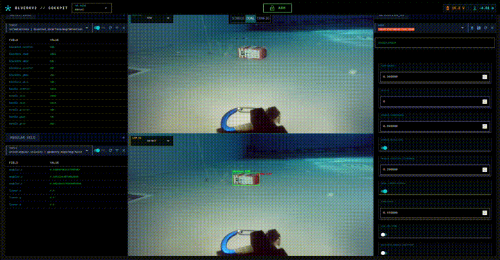
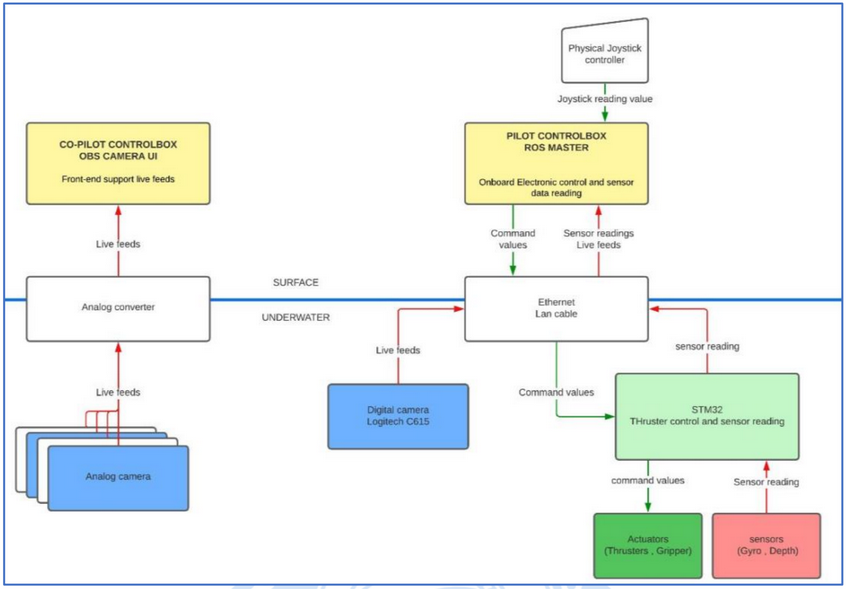

# Marine Robotics Portfolio

**Muhammad Azka Bintang Pramudya**  
[abinpramudya2@gmail.com](mailto:abinpramudya2@gmail.com) | [+33 766 877 456](tel:+33766877456) | [LinkedIn](https://linkedin.com/in/abinpramudya) | Corte, France  

---

## BlueROV2 Black Box Recovery System  
**Universitat de Jaume I** | September 2025 – December 2025  

Semi-autonomous black box recovery system using YOLO detection and sensor fusion for underwater target localization. Custom NiceGUI interface for operator oversight.  

  
[Repository](https://github.com/MahmoudAboelrayat/bluerov2_blackbox_recovery) | [Report](https://drive.google.com/file/d/1SBYBy8Xy-rLB0mjOmzVj8JvZ5hJXIhgA/view?usp=drive_link)  

**ROS2 • Python • Linux • YOLO • NiceGUI**

---

## BlueROV2 Sensor Integration & SLAM  
**COSMER Lab, Université de Toulon** | June 2025 – July 2025  

BlueROV2 platform extension with stereo vision, Ping360 sonar, and ORB-SLAM3 for underwater localization. ROS2 sensor fusion and real-time SLAM implementation.  

  
  
[Repository](https://github.com/Abinpramudya/BlueROV2025)  

**ROS2 • Python • C++ • ORB-SLAM3 • Ping360**

---

## Naru MK II ROV  
**Banyubramanta ITS Team** | January 2023 – May 2023  

Competition ROV software (1st place MATE ROV ASEAN Championship, Explorer Class). Full stack: TensorFlow vision to STM32 motor control.  

[Repository](https://github.com/Abinpramudya/MATE'23_WS) | [Technical Report](https://drive.google.com/file/d/14r0WjVaANPhX_nG3z-hD1IdhIqXwtY4q/view?usp=drive_link) 

**ROS • Python • TensorFlow • Vue.js • STM32**

---

## Naru MK I AUV  
**Banyubramanta ITS Team** | June 2022 – September 2022  

Autonomous underwater vehicle for Singapore AUV Challenge (1st place qualifiers, 42 teams). YOLOv5 vision and ROS autonomy stack.  

[Repository](https://github.com/Abinpramudya/SAUVC2022_WS)

**ROS • Python • YOLOv5 • TensorFlow • STM32**
